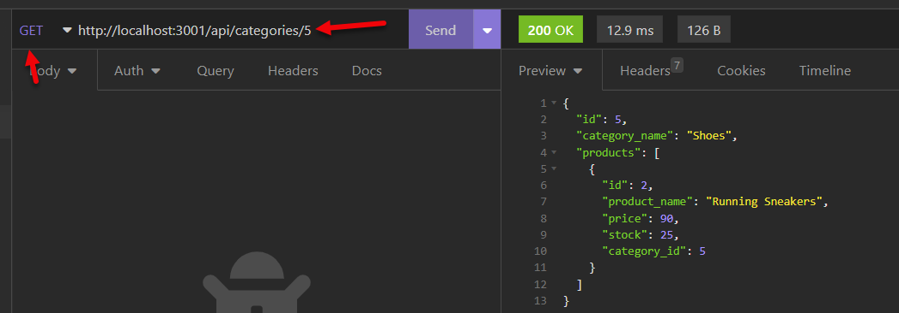

  # [](https://opensource.org/licenses/MIT)

  # E-Commerce Back End

  ## Table of Contents
 - [Description](#description)
 - [Installation](#installation)
 - [Usage](#usage)
 - [License](#license)
 - [Test Instructions](#test-instructions)
 - [Credits](#credits)
 - [Questions](#questions)
  
  ## Description
  This is the backend of an ecommerce application which contains tables for categories, products, tags and product_tags. It contains routes to view all categories, products and tags and to perform CRUD operations on these items. It has an Express.js API for all CRUD operations and uses Sequelize to interact with MySQL where the data is stored. The API has been tested using Insomnia. The dotenv package is utilised to store sensitive data.
  
  The application is developed using the following technologies:
  - javascript
  - node.js
  - Sequelize
  - MySQL2
  - Express.js
  - dotenv package

  The main challenge in developing this application was familiarisation with Sequelize, in particular defining the associations between Models. 


  ## Installation
  Ensure node is installed. Test by running 
  ```
  node -v
  ```

  To install this package run:
  ```
  npm install
  ```

  ## Usage
  To run this application ensure you are in the main ecommerce-backend directory. To start the server run:
```
npm start
```
You should see the server startup message:


Once the server is running you can use Insomnia, Postman or another API client to test the endpoints.
There are endpoints to POST, GET, PUT and DELETE, categories, products and tags and all start with one of the below:
- http://localhost:3001/api/categories

- http://localhost:3001/api/products

- http://localhost:3001/api/tags

Below are some samples:





The database has been seeded already but to reseed run :
```
npm run seed
```
Note product_tag is a pivot table linking Products and Tags.

Below is a link to a video recording of how the application works.

  [Video](https://watch.screencastify.com/v/zSBaIxdTmCsEknzHWHCF)

  ## License
  This project is covered by the "The MIT License" license.
  For more details click on the link below:
  [License](https://opensource.org/licenses/MIT)
  
  
  ## Test Instructions
  The application can be tested using an API client such as Insomnia. The api is outlined in usage above. Please check models/Category.js, models/Product.js and models/ProductTag.js to see the expected fields for each model.


  ## Credits
  I would like to thank the instructors at UWA Bootcamp. 
  
  ## Questions
 If you have any questions or feedback please contact me. My details are below. As this is a learning challenge for me I would appreciate any feedback, or ideas for improvement.

 Github : https://github.com/HelenELee 

 Email : helenelee3@outlook.com
  
